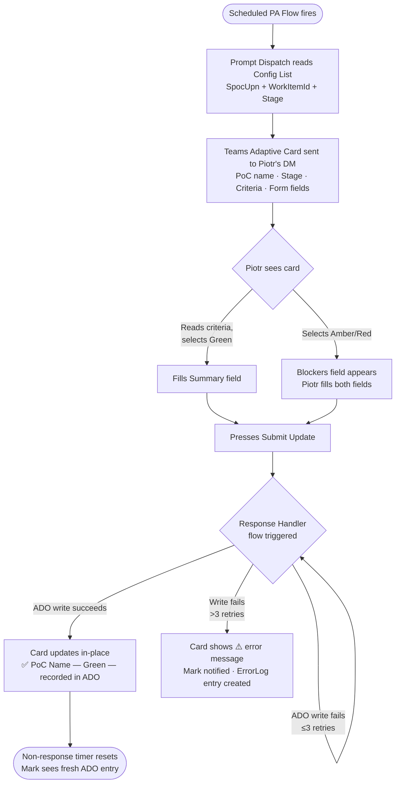
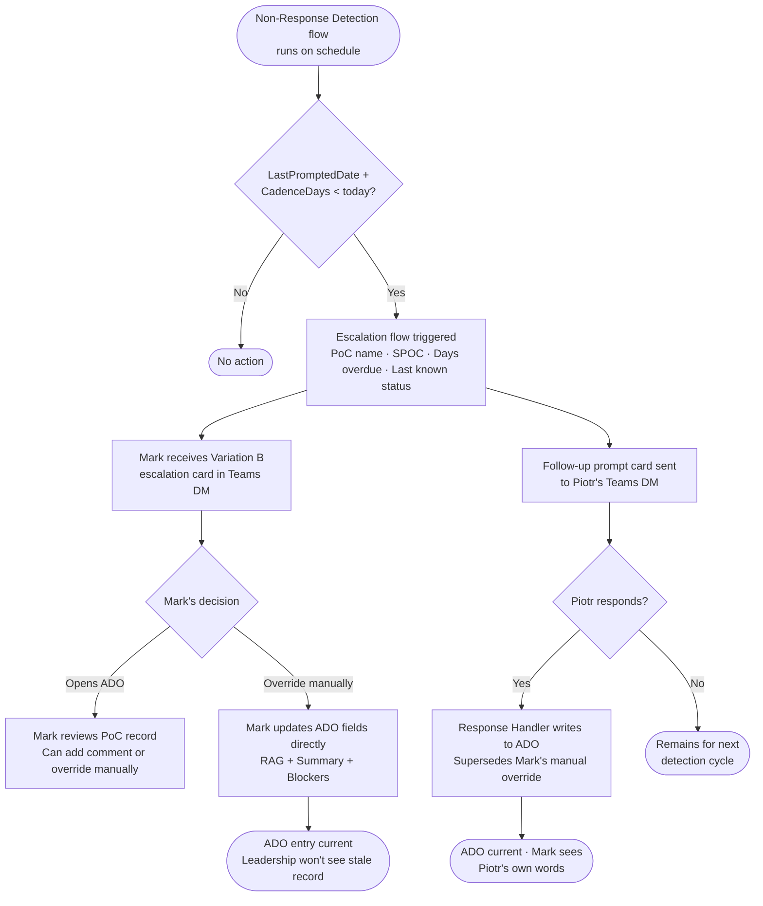
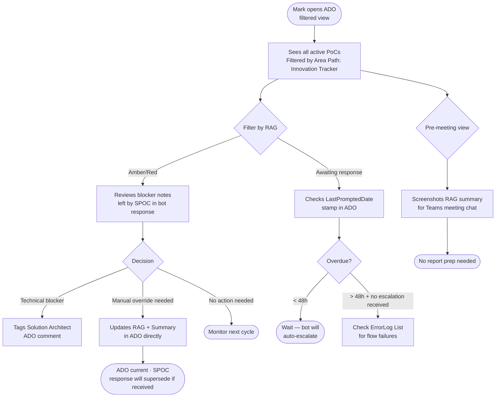

# UX Design Specification — Innovation Funnel Tracker

**Author:** Michal
**Date:** 2026-03-06

---

<!-- UX design content will be appended sequentially through collaborative workflow steps -->

## Executive Summary

### Project Vision

The Innovation Funnel Tracker UX operates entirely within the Microsoft ecosystem — no custom frontend. The designed experience lives in three surfaces: Teams Adaptive Card interactions (the bot prompt and response), Teams notification messages (acknowledgement, escalation, follow-up), and ADO views (pipeline visibility). The UX goal is behavioral: make submitting a status update the lowest-friction path available, so PoC owners do it in under 60 seconds without thinking.

### Target Users

Five distinct user groups interact with the system, each with a different primary surface:
- **PoC Owners (Piotr)**: Teams DM only — receive prompts, submit Adaptive Card responses
- **Innovation PO (Mark)**: Teams DM + Microsoft Lists — receives escalation alerts, manages SPOC roster
- **Innovation Lead (Michal)**: ADO filtered views — pipeline visibility, ad-hoc leadership queries
- **Solution Architects (Christian)**: ADO filtered views — tech area + RAG triage
- **Leadership**: ADO filtered views — phase distribution and RAG summary

### Key Design Challenges

1. **Card cognitive load**: Prompt must include stage criteria without overwhelming the reader — balance between context-completeness and scan-ability
2. **Conditional UI**: Blockers field should only surface when RAG is Amber or Red — requires careful Adaptive Card JSON specification
3. **Prompt tone**: Message framing must feel helpful and lightweight, not surveillance-like — tone directly impacts response rate

### Design Opportunities

1. **Stage criteria as centrepiece**: The card anchors around "here's exactly what's expected at your stage" — a key differentiator vs. generic status requests
2. **Acknowledgement as reinforcement**: Confirmation message reflects back the submitted values, building trust that the update actually landed in ADO
3. **Escalation as decision support**: Mark's notification includes context (days since last update, PoC name, stage) to enable immediate action without opening ADO

## Core User Experience

### Defining Experience

The single most critical interaction is Piotr submitting the Adaptive Card response in Teams. The entire system's behavioural goal — replacing manual status chasing — depends on this being so frictionless that PoC owners do it reflexively. Everything downstream (ADO write-back, acknowledgement, escalation prevention) depends on this one action succeeding.

### Platform Strategy

No custom frontend. UX design scope is Teams message and card design plus ADO view configuration guidance:

- **Teams (desktop + mobile)**: Bot prompt, Adaptive Card form, acknowledgement message, escalation notification, follow-up prompt
- **ADO**: Pipeline views, work item management — Microsoft-native UI, configured via saved queries and area path filters
- **Microsoft Lists**: SPOC roster admin — Microsoft-native UI, edited by Mark directly

### Effortless Interactions

- **Card submission**: RAG dropdown → one-sentence summary → Submit. Zero navigation, zero login, zero context-switching from Teams
- **Conditional blockers field**: Appears only when Amber/Red selected — Green path has no unnecessary fields
- **Acknowledgement**: Instant and automatic; echoes back submitted values so Piotr knows the update landed
- **Escalation self-containment**: Mark's notification includes all context needed to act without opening ADO

### Critical Success Moments

1. **First submission (Piotr)**: First impression defines the habit — the prompt copy and stage criteria must be clear enough that Piotr submits without questions on first encounter
2. **Acknowledgement receipt**: "Your update for [PoC Name] has been recorded" establishes trust that the system actually works
3. **Escalation context (Mark)**: Notification contains PoC name, SPOC, days overdue, and last known status — actionable without clicking into ADO
4. **Error state handling**: If card submission fails, Piotr must receive a clear error signal — silent failure destroys trust

### Experience Principles

1. **Come to the user** — All interactions initiate from the system via Teams; users never navigate anywhere
2. **Context in the moment** — Each message carries exactly what's needed right then (stage criteria in prompt, submitted values in ack, PoC context in escalation)
3. **One action, one outcome** — Submit the card → update recorded. No multi-step flows.
4. **Silence means trust** — Supported by explicit acknowledgement; confirmed delivery removes ambiguity

## Desired Emotional Response

### Primary Emotional Goals

- **Relief** (PoC Owners): "That was easy, I'm done" — the dominant post-submission emotion
- **In Control** (Innovation PO): The system does the chasing; Mark handles exceptions calmly
- **Confidence** (Innovation Lead / Leadership): Any pipeline question answerable on the spot, with certainty that data is current

### Emotional Journey Mapping

| Moment | User | Target Emotion | Avoid |
|---|---|---|---|
| Bot prompt arrives | Piotr | Low-effort obligation — "Oh, that's easy" | Dread, resentment |
| Filling out the card | Piotr | Focused, clear — knows exactly what to write | Confusion, uncertainty |
| Post-submit acknowledgement | Piotr | Relief — "it worked" | Doubt about whether it landed |
| Non-response notification | Mark | Readiness — "I know what to do" | Alarm, overwhelm |
| Opening ADO pipeline view | Michal | Confidence — complete, current picture | Skepticism about freshness |
| First-time card encounter | Piotr | Clarity — "I understand what's being asked" | Confusion, suspicion |

### Micro-Emotions

- **Trust vs. Skepticism**: Acknowledgement message is the primary trust signal — Piotr must see that submission actually updated ADO
- **Confidence vs. Confusion**: Stage criteria in the prompt are the card's most important emotional job — eliminate "what am I supposed to say?" uncertainty
- **Accomplishment vs. Frustration**: 60-second completion is the accomplishment target; longer tips toward frustration
- **Calm vs. Alarm**: Escalation messages must be informative not alarming — tone is as important as content

### Design Implications

| Emotion Goal | UX Design Approach |
|---|---|
| Relief (post-submit) | Acknowledgement echoes back submitted values — "Got it. [PoC Name]: Green ✓" |
| Low-pressure obligation | Prompt copy uses "quick update" language; no urgency markers |
| Clarity (what's expected) | Stage criteria as a short numbered list directly above the RAG dropdown |
| In control (Mark) | Escalation message leads with action options, not just the problem |
| Confidence (leadership) | ADO views show last-updated timestamp prominently on every record |
| Trust (all) | System never goes silent — acknowledgements on success, clear error messages on failure |

### Emotional Design Principles

1. **Remove dread before adding delight** — The absence of negative feeling (surveillance, judgment, administrative burden) matters more than positive flourishes for this audience
2. **Acknowledgement is not optional** — Every action must have a visible outcome; silence destroys trust in an enterprise tool
3. **Tone carries the experience** — For an internal bot, copy tone is the primary emotional lever; visual design is secondary
4. **Escalation is empowerment, not alarm** — Mark's notifications frame exceptions as decision moments, not system failures

## UX Pattern Analysis & Inspiration

### Inspiring Products Analysis

**Polly (Teams survey bot)**
Masters low-friction in-chat form responses. Presents question and response options in one compact card; confirmation updates the card rather than sending a new message.
*Key lesson*: Response and confirmation can live in the same card space.

**Azure DevOps PR notifications in Teams**
Gold standard for contextual enterprise cards — PR title, reviewer, branch visible without opening ADO. Action buttons ("Approve", "View PR") embedded directly in card.
*Key lesson*: Contextual data + one-click action eliminates the need to navigate away.

**PagerDuty incident alerts**
Never announces a problem without an action option. Leads with severity + name, pairs with Acknowledge/Resolve buttons.
*Key lesson*: Escalation design = problem + action path, not problem alone.

**GitHub Actions bot**
✅/❌ as first visual element — status scannable in under a second. Failure messages identify the specific failing step.
*Key lesson*: Specificity earns trust; generic confirmation messages get ignored.

### Transferable UX Patterns

**Interaction patterns:**
- **In-card confirmation** (Polly): Adaptive Card updates its own body to show "✅ Submitted — Green" after submission, instead of a separate confirmation message
- **Action-paired notification** (PagerDuty): Mark's escalation notification includes an "Open ADO" button, not just informational text
- **Contextual card data** (ADO PR cards): Prompt card embeds PoC name, current stage, and last-updated date — no need to open ADO to remember context

**Visual/scan patterns:**
- **Status-first** (GitHub Actions): Acknowledgement leads with colour-coded status indicator — "🟢 Green recorded for [PoC Name]"
- **Progressive disclosure** (Polly): Blockers field appears only on Amber/Red selection, mirrors Polly's conditional question pattern

### Anti-Patterns to Avoid

- **Generic acknowledgements**: "Your response was received" — specific confirmation beats generic noise that enterprise users learn to ignore
- **Multi-message flows**: Prompt + loading + confirmation as three separate messages creates Teams DM noise; one card, one outcome
- **Verbose stage criteria**: Full prose lists on the card create a wall of text; short numbered bullets only
- **Alert-only escalation**: Notifications without action paths get muted; every alert must offer a next step

### Design Inspiration Strategy

**Adopt:**
- Contextual data embedded in prompt card (ADO PR card pattern)
- Action-paired escalation notification (PagerDuty pattern)

**Adapt:**
- In-card confirmation (Polly) — adapted for Adaptive Cards JSON update mechanism
- Status-first acknowledgement (GitHub Actions) — adapted for Teams Adaptive Card visual palette

**Avoid:**
- Generic confirmation copy
- Multi-message response flows
- Full-prose stage criteria on the card

## Design System Foundation

### Design System Choice

**Microsoft Adaptive Cards + Fluent Design System (platform-imposed)**

The design system is determined by the deployment platform — Microsoft Teams renders all Adaptive Cards using the Fluent Design System automatically. No design system selection is required; visual consistency is inherited from the user's active Teams theme.

### Rationale for Selection

- Platform constraint: Adaptive Cards are the only interaction surface available in Teams without a custom bot framework
- Zero maintenance: Fluent Design System updates with Teams — no design debt
- User familiarity: PoC Owners interact with Fluent Design throughout their working day; the bot prompt feels native, not foreign
- Accessibility: Teams themes include High Contrast mode; Adaptive Cards inherit this automatically

### Implementation Approach

Card design is expressed entirely in **Adaptive Card JSON schema** (version 1.4+). No CSS, no component libraries, no front-end framework needed. Vendor implements cards as JSON templates within Power Automate flow definitions.

**Component palette:**

| Element | Usage |
|---|---|
| `TextBlock` | PoC name, stage label, criteria list, prompt copy, ack message |
| `Input.ChoiceSet` (compact) | RAG status dropdown: Green / Amber / Red |
| `Input.Text` (single line) | Summary field |
| `Input.Text` (multiline, hidden by default) | Blockers field — shown on Amber/Red selection |
| `Action.Submit` | Primary submission button |
| `Action.OpenUrl` | "Open ADO" button in escalation notifications |
| `Action.ToggleVisibility` | Reveals blockers field when Amber/Red selected |

### Customisation Strategy

**Colour tokens (Fluent semantic — do not hardcode hex values):**
- `"color": "Good"` — Green status indicators
- `"color": "Warning"` — Amber status indicators
- `"color": "Attention"` — Red status indicators, error states
- `"color": "Accent"` — Submit button, primary actions
- `"weight": "Bolder"` — PoC name, section headers

**Layout principles:**
- Max two columns; single-column preferred for mobile readability
- Separator lines between card sections (header / criteria / response fields)
- Criteria list as compact TextBlock items, not nested containers

## 2. Core User Experience

### 2.1 Defining Experience

> "Reply to the bot prompt in Teams and your PoC status is updated — done in under a minute."

The defining experience borrows from the most familiar interaction in the Microsoft ecosystem: replying to a Teams DM. It flips the mental model of status updates from "filing a report" (multi-step chore) to "replying to a message" (reflexive, zero-friction). If this one interaction is nailed, every other part of the system works.

### 2.2 User Mental Model

PoC Owners currently experience status updates as a multi-step filing task: remember to update, find the right system, determine what's expected, enter it. The bot replaces this with a reply-to-message model — the lowest-friction digital action in their day.

**What we keep from existing approach:**
- Teams DM is instant, familiar, mobile-ready
- ADO is the authoritative record engineers trust

**What we eliminate:**
- Having to remember to update (system triggers them)
- Not knowing which system matters (Teams DM is the only surface)
- Not knowing what's expected (stage criteria delivered in the prompt)

### 2.3 Success Criteria

- Submission completed in under 60 seconds from prompt receipt
- User never leaves Teams during the interaction
- Immediate visible confirmation that the update was recorded
- Stage criteria eliminate all ambiguity about what to write
- Mobile experience is identical to desktop

### 2.4 Novel UX Patterns

The core pattern is **established** — replying to a message — enriched by Adaptive Card structure. No user education required; dropdown, text field, and submit button are universally understood form controls.

**Our unique twist:** The card delivers context *to* the user (stage criteria, PoC name, current phase) rather than expecting recall. This is what differentiates the experience from a generic status form.

**Conditional disclosure** (blockers field on Amber/Red) is self-explanatory from context and requires no instruction.

### 2.5 Experience Mechanics

**1. Initiation**
- Trigger: Scheduled Power Automate flow fires at configured cadence
- Delivery: Teams DM from "Innovation Tracker Bot" in Piotr's personal chat
- Visual: Card header = PoC name (immediately scannable)

**2. Interaction**
- User reads stage criteria (3–5 bullets above the RAG dropdown)
- Selects RAG status: Green / Amber / Red
- Types one-sentence summary in Summary field
- If Amber/Red: Blockers field becomes visible; user adds context
- Presses Submit

**3. Feedback**
- Success: Card updates in-place — form replaced by confirmation state showing submitted values: "✅ [PoC Name] — Green — recorded in ADO"
- Error: Card shows "⚠️ Update not saved — please try again or contact [Mark's name]"
- No secondary message; confirmation lives within the card itself

**4. Completion**
- Piotr is done; no further action required
- ADO Feature updated automatically by Response Handler flow
- Mark sees fresh status in ADO; non-response detection clock resets

## Visual Design Foundation

### Color System

Fluent Design System semantic colour tokens — inherited from Teams theme automatically. No custom brand palette required at this stage.

| Token | Usage |
|---|---|
| `Good` | Green RAG status indicators, success states |
| `Warning` | Amber RAG status indicators |
| `Attention` | Red RAG status indicators, error states |
| `Accent` | Submit button, primary call-to-action |
| `Default` | All body copy, labels, criteria text |

RAG colour semantics are universally understood in the Microsoft enterprise context — no legend or explanation needed in the card.

### Typography System

Inherited from Teams Fluent Design System. Copy tone is the primary lever, not font choice.

- `"weight": "Bolder"` — PoC name (card header), section labels
- `"weight": "Default"` — All body copy, criteria bullets, field labels, prompt copy
- `"size": "Small"` — Secondary context (last-updated date, stage label subtitle)
- `"isSubtle": true` — De-emphasised metadata (timestamps, helper text)

### Spacing & Layout Foundation

- **Single-column layout** — primary structure; mobile and desktop identical
- **Separator elements** — divide card into three sections: header / criteria / response fields
- **Compact density** — no excessive padding; card should feel efficient, not spacious
- **Criteria list** — flat TextBlock items with `•` prefix; no nested ColumnSets

### Accessibility Considerations

- Teams High Contrast mode inherited automatically — no additional work required
- All interactive elements (`Input.ChoiceSet`, `Input.Text`, `Action.Submit`) are natively keyboard-accessible within the Adaptive Card schema
- Colour is never the sole indicator of meaning — RAG label text always accompanies colour token

## Design Direction Decision

### Design Directions Explored

4 Adaptive Card layout approaches were explored:
- Direction 1 — Contextual First: PoC context and stage criteria lead; form follows
- Direction 2 — Compact Inline: Criteria collapsed to a single summary line; two-column form
- Direction 3 — Stage Prominent: Numbered criteria as centrepiece; strong visual hierarchy
- Direction 4 — Action First: RAG as prominent choice buttons; criteria hidden by default

2 escalation notification variations:
- Variation A — Concise: Problem + two action buttons; minimal prose
- Variation B — Contextual: Last known RAG/summary included; full decision context in card

### Chosen Direction

**Prompt card: Direction 1 — Contextual First**
**Escalation notification: Variation B — Contextual**

### Design Rationale

**Direction 1 selected because:**
- Stage criteria are prominent and readable — critical for habit formation on first encounter
- PoC name and stage badge immediately orient the user before they read anything else
- Last-updated metadata adds accountability context without being alarming
- Separator sections create clear visual flow: who you are / what's expected / your response
- Tallest card trade-off is acceptable — PoC owners are primarily in Teams on desktop

**Field label change:** "One-sentence summary" → **"Summary"** — removes prescriptive constraint from the label; placeholder text carries the guidance instead.

**Variation B selected because:**
- Mark should be able to assess severity and decide on action without opening ADO
- Last known RAG + summary provides the context needed for that decision
- "A follow-up prompt has been sent to Piotr" reduces redundant manual follow-up
- "Override manually" as a labelled action is clearer than a generic secondary button

### Implementation Approach

Vendor to implement Direction 1 as the primary Adaptive Card JSON template. Structural elements in order:

1. PoC name — TextBlock, weight: Bolder, size: Medium
2. Stage badge — TextBlock, isSubtle: false
3. Last-updated metadata — TextBlock, size: Small, isSubtle: true
4. Separator
5. "What we need at this stage:" — TextBlock, weight: Bolder, size: Small
6. Criteria as flat bullet list — TextBlock items with • prefix
7. Separator
8. Prompt copy — TextBlock, default weight
9. "RAG Status" label + Input.ChoiceSet (compact): Green / Amber / Red
10. "Summary" label + Input.Text (placeholder: "Where things stand right now…")
11. "Blockers" label + Input.Text (isVisible: false by default; shown on Amber/Red via Action.ToggleVisibility)
12. Action.Submit ("Submit Update")
13. **Confirmed state**: card body replaced with ✅ + PoC name + RAG + summary + timestamp

**Escalation card (Variation B) elements:**
1. ⚠️ "Non-Response Alert" heading — TextBlock, color: Warning, weight: Bolder
2. PoC name — TextBlock, weight: Bolder
3. SPOC name, days since last update, stage, last known RAG + summary — TextBlock, isSubtle: true
4. "A follow-up prompt has been sent to [SPOC]." — TextBlock, isSubtle: true
5. Separator
6. Action.OpenUrl ("Open in ADO") + Action.Submit ("Override manually")

## User Journey Flows

### Journey 1: PoC Owner Status Update (Happy Path)

### Journey 2: Non-Response Detection & Escalation

### Journey 3: Mark — Pipeline Management

### Journey Patterns

- **Trigger → Contextual card → Structured response → Silent write-back**: the core loop used in Journeys 1 and 2; no user navigation at any step
- **Problem + action**: every notification to Mark pairs a problem statement with explicit next actions — never alert-only
- **Supersede, don't block**: manual PO overrides are always overwriteable by a subsequent SPOC response — system never locks out the source of truth

### Flow Optimisation Principles

1. Decision points for Piotr are minimised to one (RAG selection), which conditionally reveals the only additional field needed
2. Mark's flows are ADO-native — no new tools or extra surfaces to learn
3. Every failure path has a visible signal (error card, ErrorLog entry, Mark notification) — no silent failures anywhere in the system

## Component Strategy

### Design System Components

The Innovation Funnel Tracker uses Microsoft Adaptive Cards (v1.4+) as its exclusive UI layer, with Fluent Design System semantic tokens for colour. All required UI capabilities are natively available in the Adaptive Cards schema: `TextBlock`, `ColumnSet`, `FactSet`, `Input.ChoiceSet`, `Input.Text` (multiline), `Container` (with semantic `style`), `Action.Submit`, `Action.ToggleVisibility`, and `Action.OpenUrl`. No component library gaps exist.

### Custom Components

Two canonical card templates compose the entire user-facing surface:

**Template 1: StatusPromptCard** — sent weekly to PoC Owners in Teams DM. Anatomy: stage badge container → FactSet context (criteria, last status, last updated) → divider → RAG ChoiceSet (label: "Status") → Summary text input → conditional Blockers input (shown Amber/Red via ToggleVisibility) → Submit action. Post-submit: card body replaced with in-card confirmation state (style: "good", timestamp, notification message).

**Template 2: EscalationNotificationCard** — sent to Innovation PO on missed deadline. Anatomy: warning-styled container with PoC name + stage → FactSet with last known RAG + summary + overdue duration → two horizontal actions: "Open in ADO" (OpenUrl) and "Override manually" (Submit). Post-action: card replaced with override confirmation.

Both templates include accessible `label` attributes on all inputs and convey status via both colour and text.

### Component Implementation Strategy

- Authored in Adaptive Card Designer; JSON stored in Power Automate or SharePoint for maintainability
- Use Fluent semantic tokens exclusively (good / warning / attention / accent) — no hardcoded hex values
- Conditional fields implemented via `Action.ToggleVisibility` — never add/remove fields post-send
- In-card confirmation state implemented via card body replacement (Polly pattern)

### Implementation Roadmap

**Phase 1 (Core / MVP):** StatusPromptCard.json + ConfirmationState — enables happy path defining experience.

**Phase 2 (Escalation):** EscalationNotificationCard.json — enables non-response/escalation journey.

**Phase 3 (Enhancement):** Parameterised templates with ADO data binding (auto-fill Last Status / Last Summary from ADO API).

## UX Consistency Patterns

### Button Hierarchy

Primary actions (Action.Submit) always last in ActionSet (rightmost). Secondary actions (Action.OpenUrl) precede primary. Tertiary reveal actions (Action.ToggleVisibility) styled as inline/text-link. Never more than two actions per card. Labels always use verbs: "Submit Update", "Override manually", "Open in ADO".

### Feedback Patterns

All feedback delivered in-card via card body replacement or inline TextBlock — no external notifications. Success: card body replaced with style:"good" container showing PoC name, RAG, timestamp, and "Mark has been notified." Error (transient): inline TextBlock with color:"attention" above Submit. Error (persistent): card body replaced with style:"attention" container. Warning/overdue: style:"warning" header container. Rule: status always conveyed via both colour token AND text label — never colour alone.

### Form Patterns

Field order: read-only context (FactSet) → inputs → actions. Conditional fields revealed via Action.ToggleVisibility only — never re-sent. All Input.* elements use the `label` property. Placeholder text is conversational. Submit always at bottom with a verb label. Amber/Red selection reveals Blockers field automatically; Green hides it.

### Status Communication Pattern

RAG mapping used consistently across all surfaces:
- Green → style:"good" / value:"green" / label:"Green – On track"
- Amber → style:"warning" / value:"amber" / label:"Amber – Some concerns"
- Red → style:"attention" / value:"red" / label:"Red – Blocked / at risk"

This mapping is never varied between StatusPromptCard, ConfirmationState, and EscalationNotificationCard.

### Notification Timing Pattern

One card per PoC per cadence period. StatusPromptCard sent on schedule to PoC Owner. ConfirmationState replaces card on submit. EscalationNotificationCard sent after cadence + N days with no response. Non-response detection always checks LastPromptedDate before firing.

## Responsive Design & Accessibility

### Responsive Strategy

No custom responsive design decisions required. Teams renders Adaptive Cards natively across all clients (Desktop, Mobile, Web) with automatic reflow. Rules: never set fixed pixel widths; use width:"stretch" or width:"auto" in all ColumnSet columns; limit ColumnSet to maximum 3 columns to ensure mobile readability. Direction 1 (stacked layout) is inherently mobile-safe.

### Breakpoint Strategy

Not applicable — Adaptive Cards schema has no breakpoint mechanism. Teams handles all client-side adaptation. Cards must be readable at a minimum of ~320px width. Direction 1 (Contextual First, stacked) satisfies this constraint without any additional breakpoint logic.

### Accessibility Strategy

Target: WCAG 2.1 AA. Microsoft Teams and Fluent Design System provide the accessibility foundation. Card authoring obligations: `label` property on all Input.* elements; descriptive `title` attributes on all actions; `altText` on any Image elements; RAG status always communicated via both colour token AND text label (enforced by UX pattern rule); TextBlock headings use size:"Medium"/"Large" for screen reader hierarchy. Colour contrast AA compliance is inherent to Fluent semantic tokens.

### Testing Strategy

Card rendering: Adaptive Card Designer (desktop + mobile preview). Teams Desktop: manual test via PA test run. Teams Mobile: manual test iOS/Android. Screen reader: Windows Narrator or NVDA with Teams Desktop. Keyboard: tab through all fields, submit without mouse. Colour-blind simulation: Designer colour-blind mode (all states are text-labelled as fallback).

### Implementation Guidelines

1. Always use `label` property on Input.ChoiceSet and Input.Text — never a TextBlock as label substitute
2. Avoid fixed-width columns — use width:"stretch" or width:"auto" in all ColumnSet
3. Test in Designer mobile view before Teams deployment
4. Action titles must be descriptive verbs: "Submit Update", "Override manually", "Open in ADO"
5. Schema version locked to v1.4 — do not upgrade without cross-client testing
